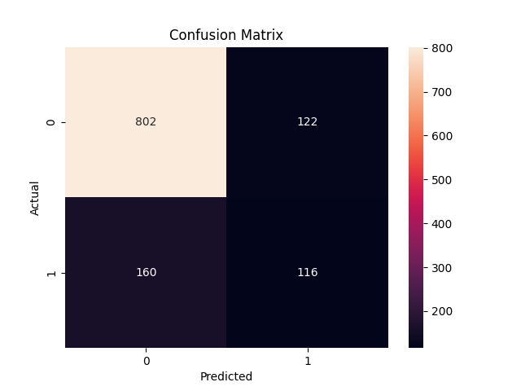

# ocean-noise-pollution-analyzer-Enhanced
Machine Learning project for classification and analysis of marine noise pollution based on audio signal processing and model leaderboard by performance metrics

## 🚀 Features
- Data preprocessing and cleaning
- Noise pattern analysis
- Data visualization
- Insight generation

## 🛠️ Tech Stack
- Python
- Pandas
- NumPy
- Matplotlib , Seaborn

## 📂 Project Structure
data/ → dataset files  
src/ → source code  
leaderboard.csv → model results  
README.md → documentation  


---

## 📊 Dataset
The dataset used in this project is stored in the `data/` folder and contains ocean noise pollution data for analysis.

---

## 🏆 Leaderboard
The `leaderboard.csv` file tracks model performance using metrics such as Accuracy, Precision, Recall, and F1 Score.

### Rules for Contributors:
- Do NOT delete existing entries  
- Only append new rows  
- Maintain proper format  

---

## 👩‍💻 My Contribution
- Data preprocessing and cleaning  
- Visualization and analysis  
- Improving project structure and documentation  

---

## 🤝 Collaboration
This project was originally developed as a collaborative effort with Neha and Shreyash.  
This repository contains my enhanced version with improvements.

---

## ▶️ How to Run
```bash
pip install -r requirements.txt
python main.py
```

## 📌 Future Improvements
- Add advanced ML models  
- Real-time data integration  
- Web dashboard  

## 📊 Model Evaluation

Confusion Matrix:

